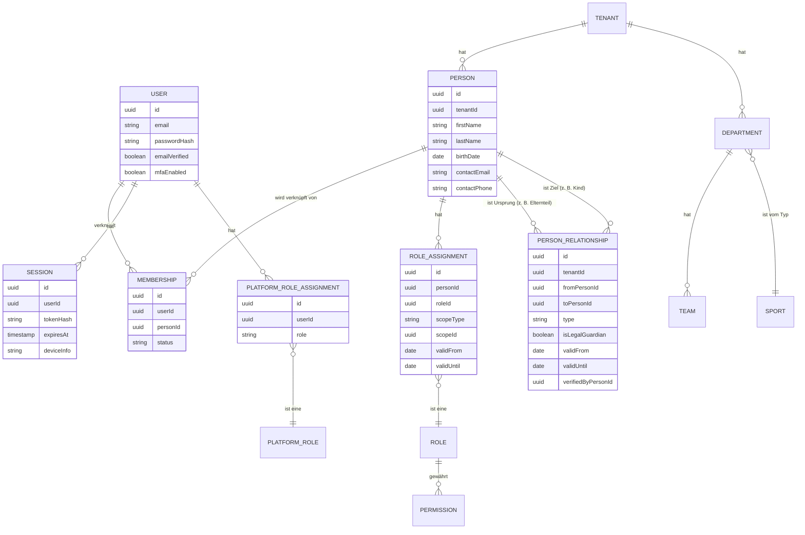

# Auth-, Identity- und RBAC-Architektur Verevia

> Status: Entwurf zur Freigabe. Baut auf [ARCHITEKTUR_BERICHT.md](./ARCHITEKTUR_BERICHT.md) auf und ersetzt dessen bisherige Auth-Empfehlung ("Auth selbst in NestJS bauen") durch eine präzisere Entscheidung.
>
> Erstellt: 2026-08-17. Kein Anwendungscode, kein Prisma-Schema, keine Dependencies im Rahmen dieser Analyse.

## 1. Executive Summary

Die bisherige Formulierung "Auth selbst in NestJS bauen" war missverständlich und wird hiermit präzisiert: Empfohlen wird **keine Eigenentwicklung sicherheitskritischer Kryptografie/Session-Logik**, sondern der Einsatz einer etablierten, selbst gehosteten Auth-Library **innerhalb** des NestJS-Backends — konkret **better-auth**, direkt auf dem gemeinsamen Postgres/Prisma-Datenbestand. Das vermeidet sowohl Eigenbau-Risiken (Option A) als auch einen zusätzlichen, eigenständigen Identity-Dienst wie Keycloak, Ory Kratos oder SuperTokens (Option C), der auf dem 8-GB-VPS zusätzliche Betriebslast erzeugen und Identitätsdaten in einem separaten Datenspeicher duplizieren würde.

Der zweite und architektonisch wichtigere Teil dieses Berichts ist die **strikte Trennung von `User` (technischer Login-Account) und `Person` (Vereinsmitglied)**. Diese Trennung ist die Voraussetzung dafür, dass minderjährige Mitglieder ohne eigenen Account vollwertig im System existieren können, dass Eltern-Kind-Beziehungen sauber als eigenständige Beziehung (`PersonRelationship`) statt als RBAC-Rolle modelliert werden, und dass ein Benutzer mehrere Vereine, mehrere Rollen und mehrere Kinder gleichzeitig abbilden kann, ohne Personendaten zu duplizieren.

Rollen werden nicht mehr direkt an `User`, sondern an `Person` gehängt (`RoleAssignment`, scope-fähig auf TENANT/DEPARTMENT/TEAM), da Berechtigungen inhaltlich eine Eigenschaft der Vereinszugehörigkeit sind, nicht des Logins. Plattformrollen (mandantenübergreifend) bleiben davon bewusst getrennt (`PlatformRoleAssignment`, direkt an `User`).

**Ergebnis:** Die Architektur ist inhaltlich tragfähig, aber **noch nicht vollständig freigabereif für das Turborepo-Skeleton** — siehe Abschnitt 17 und das Verdikt am Ende dieses Dokuments.

---

## 2. Empfohlene Authentifizierungsstrategie

**Empfehlung: Option B — etablierte Auth-Library, selbst gehostet innerhalb von `apps/api` (NestJS), auf der gemeinsamen Postgres/Prisma-Datenbank.**

Konkret: **better-auth**, gemountet als Teilbereich der NestJS-Anwendung (kein separater Prozess/Container), mit Prisma-Adapter auf dieselbe Datenbank wie der Rest der Anwendung.

### Warum nicht Option A (vollständiger Eigenbau)

Passwort-Hashing, Session-Token-Generierung, CSRF-Schutz und Rate-Limiting-Logik selbst zu entwickeln widerspricht dem OWASP-Grundsatz "don't roll your own crypto" und dem eigenen Sicherheitsgrundsatz aus `Architecture.md`. Eigenbau ist nur für die reine *Verdrahtung* (Guards, Decorators, Tenant-Kontext) sinnvoll, nicht für die kryptografischen Kernfunktionen.

### Warum nicht Option C (externer Identity-Provider als eigenständiger Dienst)

| Kandidat | Bewertung |
|---|---|
| Keycloak | Bereits in `ARCHITEKTUR_BERICHT.md` verworfen: Java-Dienst, 500 MB–1 GB RAM-Bedarf, Overengineering für den aktuellen Funktionsumfang. Bestätigt. |
| Ory Kratos | Deutlich leichter als Keycloak (Go-Binary), API-first, aber weiterhin ein separat zu betreibender Dienst mit eigenem Identitäts-Datenspeicher, der mit dem ohnehin benötigten `Person`/`Tenant`-Modell dupliziert. Kein zwingender technischer Grund für einen separaten Dienst in dieser Phase. |
| SuperTokens | Bietet nativ Multi-Tenancy-Unterstützung, aber Core läuft ebenfalls als separater Dienst (Java-basiert), zusätzlicher Betriebsaufwand ohne aktuellen Gegenwert. |
| Clerk / Auth0 / WorkOS (Managed SaaS) | Zusätzlich zum Betriebsaufwand-Argument: Personenbezogene Daten (inklusive potenziell mit Minderjährigen verknüpfter Accounts) würden bei einem US-Anbieter verarbeitet — zusätzlicher AVV- und Drittlandtransfer-Klärungsbedarf, der bei einer selbst gehosteten Lösung entfällt. Für eine Plattform mit Minderjährigen-Daten ein vermeidbares Risiko. |

Kein Kandidat unter Option C bietet einen Vorteil, der den zusätzlichen Betriebs- und Datenschutz-Aufwand in dieser Phase rechtfertigt. **Erneute Bewertung vorgesehen für Phase 7**, falls echte externe SSO-/Verbandsanbindung (z. B. Login über einen Landesverband) entsteht — das ist der einzige realistische Trigger, der einen dedizierten Identity-Provider rechtfertigen würde.

### Warum better-auth konkret (statt Passport.js-Komposition)

- Deckt nahezu alle gestellten Anforderungen bereits als Bausteine ab: E-Mail/Passwort, E-Mail-Verifizierung, Passwort-Reset, Multi-Session-Verwaltung inklusive gezielter Session-Revocation, CSRF-Schutz, Rate-Limiting-Plugin, MFA-Plugin (TOTP) und Passkey-Plugin (WebAuthn) für spätere Phasen.
- Läuft **im selben Node-Prozess** wie die NestJS-Anwendung (eingebunden als Handler/Sub-Router), erzeugt also **keinen zusätzlichen Dienst** — erfüllt damit exakt die Vorgabe "kein externer Auth-Dienst, aber auch kein Eigenbau".
- Nutzt denselben Prisma-Client/dieselbe Datenbank wie der Rest der Anwendung (eigener Prisma-Adapter vorhanden) — keine zweite Datenhaltung für Identitätsdaten, passt zum Shared-Database-Ansatz.
- Open Source, selbst gehostet, volle Kontrolle über das Datenbankschema (wichtig für DSGVO-taugliche Architektur, siehe Abschnitt 15).

**Ehrlich zu benennender Trade-off:** better-auth ist eine vergleichsweise junge Bibliothek (seit 2024, aktive Entwicklung, wachsende Verbreitung im TypeScript-Ökosystem), also weniger langjährig battle-tested als z. B. Passport.js. Deshalb wird dies **nicht blind übernommen**, sondern als **technischer Spike zu Beginn von Phase 1** verifiziert (siehe Abschnitt 17/18). Fallback bei Integrationsproblemen: Passport.js (`@nestjs/passport`, `passport-local`) kombiniert mit `argon2` (Hashing), `@nestjs/throttler` (Rate-Limiting) und einem selbst geschriebenen, aber schlanken Session-Store — jede einzelne Komponente dabei eine etablierte, eigenständige Library, keine Eigenentwicklung von Kryptografie.

---

## 3. Vergleich der untersuchten Auth-Varianten

| Kriterium | A) Eigenbau | B) better-auth (empfohlen) | B-Fallback) Passport.js-Komposition | C) Externer IdP (Keycloak/Kratos/SuperTokens/SaaS) |
|---|---|---|---|---|
| Kryptografie-Risiko | Hoch (selbst entwickelt) | Niedrig (etablierte Library) | Niedrig (etablierte Einzelbausteine) | Niedrig |
| Zusätzlicher Betriebsdienst | Nein | Nein | Nein | Ja |
| RAM-Bedarf auf VPS | Gering | Gering | Gering | Mittel–Hoch |
| Integrationsaufwand in NestJS | Hoch | Mittel (Community-Pattern vorhanden, aber noch zu verifizieren) | Mittel–Hoch (mehr Einzelteile verdrahten) | Mittel (SDKs vorhanden) |
| Multi-Session/Revocation | Selbst zu bauen | Eingebaut | Selbst zu bauen | Eingebaut |
| CSRF/Rate-Limiting | Selbst zu bauen | Eingebaut (Plugins) | Über Zusatz-Libraries | Eingebaut |
| MFA/Passkeys später | Selbst zu bauen | Plugin vorhanden | Über Zusatz-Libraries (`otplib`, `@simplewebauthn`) | Eingebaut |
| Datenhoheit/DSGVO | Voll (aber riskant) | Voll | Voll | Eingeschränkt bei SaaS-IdPs, voll bei selbst gehostetem Kratos/SuperTokens |
| Reifegrad/Track-Record | – | Jung, aktiv, wachsend | Sehr etabliert (Passport seit 2011) | Etabliert (Keycloak/Kratos), mittel (SuperTokens) |

**Verdikt:** B (better-auth) mit dokumentiertem Fallback auf B-Fallback (Passport-Komposition), beides ohne separaten Dienst. C nur als spätere Option bei echtem externen SSO-Bedarf.

---

## 4. Account-vs-Person-Modell

Striktes Prinzip: **Ein `User` ist ein Login. Eine `Person` ist ein Mensch, der dem Verein bekannt ist — mit oder ohne Login.**

- **`User`**: global, **nicht** mandantenbezogen. Enthält ausschließlich Auth-relevante Daten (E-Mail, Passwort-Hash über better-auth verwaltet, Verifizierungsstatus, MFA-Status). Ein `User` kann mit Personen in mehreren Vereinen verknüpft sein.
- **`Person`**: mandantenbezogen (`tenantId` Pflichtfeld, wie in `Database.md` bereits für andere Entitäten vorgesehen). Enthält Stammdaten (Name, Geburtsdatum, Kontaktdaten) und ist die Grundlage für alle fachlichen Verknüpfungen (Rollen, Anwesenheit, Turnierteilnahme). **Existiert unabhängig davon, ob ein `User` verknüpft ist.**

Der 8-jährige Spieler aus dem Beispiel ist eine vollständige `Person` mit `RoleAssignment(role=PLAYER, scope=TEAM)`, aber ganz ohne `User`. Erst wenn er später (z. B. mit 16) einen eigenen Account möchte, wird ein neuer `User` angelegt und über `Membership` mit **derselben, bereits existierenden** `Person` verknüpft — keine Datenduplikation, keine Historie geht verloren.

**Wichtige Konsequenz:** Auch Eltern, die selbst nie "Mitglied" im engeren Sinn sind (kein Spieler, kein Trainer), benötigen für ein einheitliches Modell **trotzdem eine `Person`** in dem jeweiligen Verein — als Trägerin ihrer `PersonRelationship` zum Kind und ihres `Membership`-Logins. Das vermeidet Sonderfälle im Datenmodell (siehe Abschnitt 6).

---

## 5. Membership-Modell

`Membership` bedeutet in diesem Modell **nicht** mehr "Vereinsmitgliedschaft mit Rolle" (wie noch in `Database.md`/`Multi-Tenancy.md` beschrieben), sondern ausschließlich: **"Dieser Login-Account (`User`) ist diese Person (`Person`)."**

```
Membership
├── userId       → User
├── personId     → Person   (Person trägt bereits tenantId)
└── status       PENDING | ACTIVE | REVOKED
```

- Ein `User` kann mehrere `Membership`-Einträge haben — je einen pro Verein, in dem er/sie als `Person` bekannt ist.
- Innerhalb eines Vereins hat ein `User` in der Regel genau eine `Membership` zu genau einer `Person` (Invariante, applikationsseitig durchgesetzt).
- `status=PENDING` bildet den Einladungs-Workflow ab (z. B. Verein legt `Person` für ein neues Mitglied an, verschickt Einladungslink, Mitglied/Elternteil erstellt `User` und "beansprucht" die `Person` → `ACTIVE`).
- Die eigentliche fachliche Berechtigung hängt **nicht** an `Membership`, sondern an `RoleAssignment` auf der `Person` (Abschnitt 7) — `Membership` regelt nur den Zugriff *auf* die Person, nicht was die Person darf.

---

## 6. Eltern-/Kind-/Guardian-Modell

**Kernentscheidung, wie im Auftrag gefordert kritisch geprüft:** `PARENT`/`GUARDIAN` ist **keine RBAC-Rolle**, sondern eine **Beziehung zwischen zwei `Person`-Datensätzen** innerhalb desselben Vereins. Es beantwortet die Frage "Wer bin ich in Bezug auf eine andere Person?" — nicht "Welche Berechtigung habe ich in der Organisation?". Eine RBAC-Rolle wie `COACH` oder `TENANT_ADMIN` beantwortet Letzteres.

### Modell: `PersonRelationship` (gerichtet, nicht bidirektional gespeichert)

```
PersonRelationship
├── tenantId          (redundant zu from/toPerson.tenantId, für direkte RLS-Policy)
├── fromPersonId       → Person   (die erziehungsberechtigte/betreuende Person)
├── toPersonId          → Person   (die betreute/minderjährige Person)
├── type                 PARENT | LEGAL_GUARDIAN | EMERGENCY_CONTACT
├── isLegalGuardian      boolean   (rechtliche Sorgeberechtigung vs. nur Notfallkontakt)
├── validFrom / validUntil   (zeitlich begrenzbar, siehe unten)
└── verifiedByPersonId    → Person (welcher Vereinsverantwortlicher hat die Beziehung bestätigt)
```

- **Gerichtet statt bidirektional**: Es wird nur `Anna --PARENT--> Max` gespeichert, nicht zusätzlich `Max --CHILD--> Anna`. Die "Kind von"-Sicht wird bei Bedarf als invertierte Abfrage berechnet, nie als zweiter Datensatz — verhindert Inkonsistenzen zwischen zwei Kopien derselben Information.
- **Mehrere Erziehungsberechtigte pro Kind**: mehrere `PersonRelationship`-Zeilen mit demselben `toPersonId`, unterschiedlichen `fromPersonId` (Anna und Thomas als getrennte Zeilen für Max) — deckt auch Patchwork-Familien ab (z. B. Stiefelternteil mit `type=LEGAL_GUARDIAN`, leiblicher Elternteil mit `type=PARENT`, `isLegalGuardian=false` bei getrenntem Sorgerecht).
- **Mehrere Kinder pro Erziehungsberechtigtem**: mehrere Zeilen mit demselben `fromPersonId`, unterschiedlichen `toPersonId`.
- **Ein Elternteil mit mehreren Rollen** (Anna ist selbst Mitglied, Trainerin einer anderen Mannschaft *und* Elternteil): unproblematisch, da `PersonRelationship` unabhängig von `RoleAssignment` existiert — Anna ist eine einzige `Person`-Zeile im Verein, die gleichzeitig Ziel mehrerer `RoleAssignment`s (Trainerin) und Ursprung einer `PersonRelationship` (Elternteil von Max) ist.
- **Verifizierung nötig**: `PersonRelationship` darf nicht ungeprüft selbst-deklariert werden (Sicherheitsrisiko, siehe Abschnitt 16) — Anlage/Bestätigung durch einen Vereinsverantwortlichen (`verifiedByPersonId`) oder durch einen bestehenden, bereits verifizierten Erziehungsberechtigten.
- **Wechsel minderjährig → volljährig**: Die `Person`-Zeile des Kindes bleibt unverändert bestehen; `PersonRelationship` erhält `validUntil` (automatisch oder manuell gesetzt, z. B. bei Volljährigkeit oder auf expliziten Wunsch), bleibt aber historisch nachvollziehbar (Auditierbarkeit) statt gelöscht zu werden.
- **Keine Datenduplizierung**: Da `PersonRelationship` nur auf bestehende `Person`-IDs verweist, existieren Namens-/Kontaktdaten von Eltern und Kindern jeweils genau einmal.

---

## 7. RoleAssignment-Modell

Ersetzt die bisherige Annahme "eine oder mehrere Rollen direkt an `Membership`" aus `Database.md`.

```
RoleAssignment
├── personId       → Person        (trägt bereits tenantId)
├── roleId          → Role
├── scopeType         TENANT | DEPARTMENT | TEAM
├── scopeId            UUID (nullable bei TENANT-Scope)
├── validFrom / validUntil   (z. B. für saisonale Trainer-Zuweisungen)
└── grantedByPersonId  → Person (Nachvollziehbarkeit)
```

Rollen hängen bewusst an `Person`, nicht an `User` — Berechtigungen sind eine Eigenschaft der Vereinszugehörigkeit, unabhängig davon, ob (noch) ein Login existiert. Ein 8-jähriger Spieler hat ein `RoleAssignment(role=PLAYER, scope=TEAM)`, obwohl er keinen `User` hat — relevant z. B. für Turnier-Teilnehmerlisten oder Trainer-Sicht auf den Kader.

### Getrennt davon: `PlatformRoleAssignment`

Plattformrollen (`Platform Owner/Administrator/Support`, siehe `Roles-and-Permissions.md`) sind **mandantenübergreifend** und nicht an eine `Person` in einem bestimmten Verein gebunden — ein Plattform-Support-Mitarbeiter muss kein Vereinsmitglied sein. Deshalb eigenständige, kleine Tabelle:

```
PlatformRoleAssignment
├── userId    → User   (direkt, kein Umweg über Person/Tenant)
└── role         SUPER_ADMIN | PLATFORM_ADMIN | PLATFORM_SUPPORT
```

Diese bewusste Trennung von `RoleAssignment` (Person-basiert, tenant-partitioniert) und `PlatformRoleAssignment` (User-basiert, global) verhindert eine unsaubere, polymorphe Modellierung ("mal Person, mal User") in einer einzigen Tabelle.

---

## 8. Scope-Konzept

**Scopes für `RoleAssignment` im MVP:** `TENANT`, `DEPARTMENT`, `TEAM`.

**Vererbungsregel (wichtig, bisher nirgends explizit dokumentiert):** Eine Rolle auf einem höheren Scope gilt automatisch auch für alle untergeordneten Scopes, sofern die Rolle das inhaltlich vorsieht — ein `TENANT_ADMIN` sieht alle Abteilungen und Teams, ein `DEPARTMENT_ADMIN` (Abteilungsleiter) alle Teams seiner Abteilung, ein `COACH` mit `TEAM`-Scope nur sein eigenes Team. Diese Kaskade wird in der Autorisierungsschicht (Abschnitt 9), nicht im Datenmodell selbst abgebildet.

**Spielgemeinschaften:** `JointTeam` (aus `ARCHITEKTUR_BERICHT.md`, Abschnitt 7) wird als `scopeType=TEAM` mit `scopeId=jointTeam.id` behandelt — kein eigener Scope-Typ nötig, da eine `JointTeam` sich für Autorisierungszwecke wie ein normales Team verhält.

**Realistisch sinnvolle künftige Scopes (nicht jetzt umzusetzen, nur vorgemerkt):**
- `TOURNAMENT` — für temporäre Turnier-Organisator-Rollen (Phase 5), die nicht an ein festes Team gebunden sind.
- Kein eigener `SEASON`-Scope nötig — zeitliche Begrenzung wird stattdessen generisch über `validFrom`/`validUntil` auf `RoleAssignment` gelöst (deckt sowohl saisonale als auch beliebige andere befristete Zuweisungen ab, ohne einen weiteren Scope-Typ einzuführen).

---

## 9. Permission-/Authorization-Konzept

**Empfehlung: RBAC als strukturelles Rückgrat + kontextabhängige Policies (ABAC/ReBAC-Schicht) darüber — nicht reines RBAC.**

Begründung anhand der beiden Beispiele aus dem Auftrag:

- *"Trainer darf Kontaktdaten der Spieler seiner Mannschaft sehen, aber nicht automatisch Mitglieder einer anderen Abteilung"* → reine RBAC-Prüfung ("hat Rolle COACH") reicht nicht, es muss zusätzlich geprüft werden, **auf welchem Scope** diese Rolle gilt, und ob die angefragte `Person` innerhalb dieses Scopes liegt (scope-bezogene Bedingung).
- *"Elternteil darf Daten seines eigenen Kindes sehen, aber nicht automatisch Daten aller Mannschaftsmitglieder"* → das ist **keine** RBAC-Frage, sondern eine `PersonRelationship`-Bedingung ("existiert eine gültige, verifizierte `PersonRelationship` vom anfragenden `Person` zur Ziel-`Person`?").

**Empfohlenes Werkzeug: CASL**, da es genau diese Kombination aus rollenbasierten und bedingungsbasierten Regeln deklarativ ausdrücken kann (`can('read', 'Person', { id: { $in: guardianChildIds } })` neben `can('read', 'Person', { scopeIds: { $in: assignedTeamIds } })`).

### Auflösungskette pro Request

```
Request (mit Session-Cookie)
  → AuthGuard: welcher User? (better-auth Session-Validierung)
  → TenantContextGuard: welcher Tenant? (siehe Abschnitt 10)
  → welche Person(en) des Users in diesem Tenant? (über Membership)
  → welche RoleAssignments dieser Person? (inkl. Scope-Kaskade)
  → welche PersonRelationships dieser Person? (für ReBAC-Bedingungen)
  → CASL-Ability zusammensetzen → Permission-Check auf konkrete Ressource/Aktion
```

**Offen für spätere Verfeinerung (siehe Abschnitt 17):** feldebenen-genaue Permissions (z. B. Telefonnummer sichtbar für Trainer, aber nicht für alle Team-Mitglieder) — architektonisch mit CASL abbildbar, aber der konkrete Permission-Katalog (Ressourcen × Aktionen × Feldebenen) ist noch nicht ausgearbeitet.

---

## 10. Zusammenspiel mit Multi-Tenancy

Da `Person`, `RoleAssignment` und `PersonRelationship` alle zwingend `tenantId`-partitioniert sind, ist die gesamte fachliche Autorisierungskette bereits auf Datenmodell-Ebene mandantengetrennt — unabhängig von RLS. `User`, `Membership`, `Session` und `PlatformRoleAssignment` bilden bewusst eine **globale Identitätsebene ohne Tenant-Partitionierung**, da ein Login mehreren Vereinen zugeordnet sein kann (Beispiel User A, Abschnitt 14).

**Aktiver Tenant-Kontext — wie bestimmt und abgesichert:**

1. Client teilt (z. B. über Subdomain, Header oder im Session-State nach Auswahl in einem "Verein wechseln"-UI) mit, in welchem Tenant-Kontext er operieren möchte.
2. `TenantContextGuard` prüft **serverseitig**, ob für den aktuellen `User` eine `Membership` mit `status=ACTIVE` zu einer `Person` in genau diesem `tenantId` existiert. Kein impliziter Zugriff nur aufgrund eines gültigen Sessions-Cookies.
3. Erst nach dieser Prüfung wird der `tenantId` in den Request-Kontext (z. B. `AsyncLocalStorage`) und in die Datenbank-Session (`SET LOCAL app.tenant_id = ...`, siehe Abschnitt 11) übernommen.
4. Ein `User`, der in zwei Vereinen aktiv ist, muss für jeden Request/jede Session explizit in einem der beiden Tenant-Kontexte agieren — es gibt keinen tenant-übergreifenden "kombinierten" Zugriff, auch nicht implizit.

Das verhindert, dass Mehrfach-Mitgliedschaft eines `User` zu einer Aufweichung der Mandantentrennung führt — der `User` selbst "weiß" zwar von beiden Vereinen, jede einzelne Datenbank-Abfrage aber operiert strikt innerhalb des einen, explizit validierten Tenant-Kontexts.

---

## 11. Zusammenspiel mit PostgreSQL RLS

RLS-Policies (`USING (tenant_id = current_setting('app.tenant_id')::uuid)`) werden auf allen tenant-partitionierten Tabellen aktiviert: `Person`, `RoleAssignment`, `PersonRelationship`, sowie alle bereits in `Database.md` vorgesehenen mandantenbezogenen Entitäten (`Department`, `Team`, `Event`, `Attendance`, `Task`, `Tournament`, …).

**Nicht RLS-partitioniert** (globale/Katalog-Tabellen ohne `tenant_id`): `User`, `Membership`, `Session`, `PlatformRoleAssignment`, `Role` (fester Rollenkatalog), `Permission` (fester Katalog), `Sport` (plattformweiter Katalog aus `ARCHITEKTUR_BERICHT.md`). Zugriff auf `Membership`/`Session` wird stattdessen applikationsseitig auf "nur die eigenen Einträge des angefragenden `User`" beschränkt — ein globaler Multi-Tenant-Browsing-Fall existiert hier nicht, da diese Tabellen nie tenant-weise durchsucht werden.

Die in Abschnitt 10 beschriebene `SET LOCAL app.tenant_id`-Zuweisung ist der konkrete Mechanismus, der den geprüften, aktiven Tenant-Kontext mit der RLS-Durchsetzung verbindet: Selbst wenn eine Anwendungs-Query versehentlich kein explizites `WHERE tenantId = …` enthält, verhindert RLS als zweite, vom Anwendungscode unabhängige Schutzschicht den Zugriff auf fremde Mandantendaten.

---

## Entity-Relationship-Modell (konzeptionell)



---

## 12. Beispiel: Benutzer mit mehreren Rollen

Maik, `Person` in Tenant "TSV Benediktbeuern":

```
RoleAssignment 1: role=MEMBER,        scope=TENANT
RoleAssignment 2: role=COACH,         scope=TEAM (E-Jugend)
RoleAssignment 3: role=PLAYER,        scope=TEAM (Alte Herren)
PersonRelationship: fromPerson=Maik, toPerson=<eigenes Kind>, type=PARENT
```

Ein einziger `User`-Account, eine einzige `Person`-Zeile in diesem Tenant, drei unabhängige `RoleAssignment`s auf unterschiedlichen Scopes plus eine `PersonRelationship`, die keine Rolle, sondern eine Beziehung ist. CASL kombiniert alle vier Fakten zu einer einzigen effektiven Berechtigungsmenge für diesen Request.

---

## 13. Beispiel: Eltern mit mehreren Kindern

```
Person: Anna
Person: Thomas
Person: Max (Kind)
Person: Lisa (Kind, zweites Kind von Anna und Thomas)

PersonRelationship: from=Anna,   to=Max,  type=PARENT, isLegalGuardian=true
PersonRelationship: from=Thomas, to=Max,  type=PARENT, isLegalGuardian=true
PersonRelationship: from=Anna,   to=Lisa, type=PARENT, isLegalGuardian=true
PersonRelationship: from=Thomas, to=Lisa, type=PARENT, isLegalGuardian=true

RoleAssignment: Anna, role=MEMBER, scope=TENANT
RoleAssignment: Anna, role=COACH,  scope=TEAM (F-Jugend, andere Mannschaft als ihre Kinder)
```

Vier `PersonRelationship`-Zeilen bilden zwei Eltern × zwei Kinder ab, ohne dass Namens- oder Kontaktdaten irgendwo dupliziert werden. Annas eigene Trainerrolle ist komplett unabhängig von ihrer Elternschaft — beide Fakten koexistieren konfliktfrei.

---

## 14. Beispiel: Benutzer in mehreren Vereinen

```
User A
├── Membership 1 → Person A1 (Tenant: Verein A) — RoleAssignment: role=COACH, scope=TEAM
└── Membership 2 → Person A2 (Tenant: Verein B) — RoleAssignment: role=PLAYER, scope=TEAM
```

`User A` ist ein einziger globaler Login-Datensatz. `Person A1` und `Person A2` sind **zwei vollständig getrennte, tenant-partitionierte Datensätze** (unterschiedliche `tenantId`, potenziell sogar unterschiedliche Kontaktdaten, falls der Nutzer das möchte). Beim Login wählt/bestätigt der Client den aktiven Tenant-Kontext (Abschnitt 10); jede Anfrage operiert danach ausschließlich innerhalb des einen gewählten Mandanten. Verein A erfährt zu keinem Zeitpunkt etwas über die Mitgliedschaft oder Rolle von `User A` in Verein B.

---

## 15. Datenschutz-by-Design-Empfehlungen

- **Datenminimierung**: `Person` erfasst nur, was für den jeweiligen Zweck nötig ist; sensible optionale Felder (z. B. medizinische Hinweise/Allergien) getrennt modellieren, nicht in die Basis-`Person`-Tabelle mischen, da hierfür ggf. Art. 9 DSGVO ("besondere Kategorien personenbezogener Daten") einschlägig ist — **rechtlich zu prüfen, bevor ein solches Feld überhaupt eingeführt wird.**
- **Account/Person-Trennung** (dieses Dokument) ist selbst bereits eine Datenschutz-by-Design-Maßnahme: Zugangsdaten (`User`) und Vereinsdaten (`Person`) sind technisch getrennt, ein kompromittierter `User`-Datensatz enthält keine Mitgliederdaten.
- **Löschbarkeit/Anonymisierung**: `Person`-Datensätze müssen anonymisierbar sein (PII-Felder überschreiben), ohne referenzielle Integrität für historische Daten (z. B. `Attendance`, `Match`-Statistiken) zu brechen — Soft-Delete/Anonymisierungs-Flag statt Hard-Delete.
- **Auditierbarkeit**: `AuditLog` (bereits in `Database.md` vorgesehen) muss mindestens erfassen: Änderungen an `RoleAssignment`, Erstellung/Bestätigung/Beendigung von `PersonRelationship`, Zugriffe auf sensible Kontakt-/Minderjährigendaten durch nicht direkt Erziehungsberechtigte (z. B. Trainer-Zugriff auf Spielerkontaktdaten).
- **Zugriffskontrolle & Tenant-Isolation**: siehe Abschnitt 9–11.
- **Verifizierung von `PersonRelationship`**: keine ungeprüfte Selbstauskunft als Elternteil (siehe Sicherheitsrisiken, Abschnitt 16).
- **Retention**: konkrete Aufbewahrungsfristen für Minderjährigendaten nach Vereinsaustritt sind eine **rechtlich zu klärende** Frage, technisch aber bereits jetzt durch die Anonymisierungsfähigkeit vorzubereiten.

### Bereiche mit zwingendem Bedarf an rechtlicher/DSGVO-Prüfung vor Pilotbetrieb

1. Rechtsgrundlage und Einwilligungs-Workflow für die Verarbeitung von Minderjährigendaten (wer erteilt Einwilligung, wie wird sie dokumentiert — `PersonRelationship.verifiedByPersonId` allein reicht rechtlich nicht als Einwilligungsnachweis).
2. Auftragsverarbeitungsverträge (AVV) mit Hostinger, Cloudflare (R2), Resend — insbesondere bei nicht-EU-Sitz einzelner Anbieter.
3. Umgang mit besonderen Datenkategorien (Gesundheitsdaten/Allergien), falls solche Felder eingeführt werden sollen.
4. Konkrete Aufbewahrungs- und Löschfristen nach Vereins-/Mannschaftsaustritt.
5. Informationspflichten gegenüber Erziehungsberechtigten bei Anlage einer `Person` für ihr Kind vor dessen möglichem eigenem Account.

Diese Punkte werden laut `Roadmap.md` regulär erst in Phase 6 (Pilotbetrieb) geprüft — **Empfehlung dieses Berichts: mindestens Punkte 1 und 5 informell vorziehen**, bevor das `Person`/`PersonRelationship`-Schema in Prisma finalisiert wird, da sie das Datenmodell selbst beeinflussen können (siehe auch Risiko in `ARCHITEKTUR_BERICHT.md`, Abschnitt "Risiken").

---

## 16. Sicherheitsrisiken

1. **Guardian-Spoofing**: Ohne Verifizierungsschritt könnte sich eine beliebige `Person` selbst als Elternteil einer anderen `Person` deklarieren und dadurch unbefugt Zugriff auf Minderjährigendaten erhalten. Mitigation: `PersonRelationship` nur durch Vereinsverantwortliche oder bereits verifizierte Erziehungsberechtigte anlegbar (`verifiedByPersonId` als Pflichtfeld, nicht optional).
2. **Scope-Eskalation**: Fehlerhafte Validierung von `RoleAssignment.scopeId` könnte dazu führen, dass eine Rolle versehentlich auf einen falschen/zu weiten Scope angewendet wird. Mitigation: strikte serverseitige Validierung, dass `scopeId` tatsächlich zum angegebenen `scopeType` und zum `tenantId` der `Person` passt, bevor ein `RoleAssignment` gespeichert wird.
3. **Tenant-Kontext-Verwechslung**: Ein Client-seitig manipulierter oder falsch verarbeiteter `tenantId`-Wert darf nicht ungeprüft übernommen werden — ausschließlich serverseitige Validierung gegen aktive `Membership`s (Abschnitt 10).
4. **Session-/Token-Diebstahl, Session Fixation**: durch better-auths Standard-Session-Handling (httpOnly, `Secure`, rotierende Tokens) weitgehend mitigiert — dennoch bei Fallback auf Passport.js explizit nachzubauen.
5. **Enumeration-Angriffe** auf Registrierung/Passwort-Reset (Rückschluss, ob eine E-Mail-Adresse registriert ist) — generische Antworttexte unabhängig vom tatsächlichen Vorhandensein des Accounts.
6. **Fehlendes Rate-Limiting** auf Login-/Reset-/Registrierungs-Endpunkten — Pflicht ab MVP (`@nestjs/throttler` zusätzlich zum better-auth-eigenen Rate-Limiting als zweite Schicht auf Gateway-Ebene).
7. **Reifegrad-Risiko better-auth**: junges Projekt, potenziell schnellere Breaking Changes oder unentdeckte Schwachstellen. Mitigation: Versionen pinnen, Security-Advisories aktiv beobachten, Passport.js-Fallback dokumentiert und im Spike mitgetestet.
8. **Datenüberhang ausgeschiedener Minderjähriger**: ohne definierten Lösch-/Anonymisierungs-Workflow (Abschnitt 15) entsteht ein wachsendes Risiko unnötig gespeicherter sensibler Daten.

---

## 17. Offene Entscheidungen

1. **Technischer Spike better-auth in NestJS** (Sessions, CSRF, Rate-Limiting, Mounting-Pattern) — muss vor endgültigem Commitment verifiziert werden; bei relevanten Problemen Wechsel auf Passport.js-Fallback.
2. **Modellierung von `RoleAssignment.scopeId`**: generisches `scopeId`+`scopeType` ohne harte DB-Fremdschlüssel-Constraint (einfacher, aber schwächere referenzielle Integrität) vs. drei separate Zuordnungstabellen je Scope-Typ (stärkere Integrität, mehr Schema-Komplexität) — Entscheidung im Rahmen der Prisma-Schema-Erstellung (Phase 1), nicht in dieser Architekturphase.
3. **Detailtiefe des Permission-Katalogs** (record-level vs. feld-level Berechtigungen, z. B. Telefonnummer-Sichtbarkeit) — für MVP-relevante Ressourcen (Person, Team, Event, Attendance) vor dem ersten CASL-Setup auszuarbeiten.
4. **Ob je Verein individuell definierbare Rollen** jemals nötig werden, oder ob der feste, plattformweite Rollenkatalog dauerhaft ausreicht — aktuell keine Anforderung, bewusst offengelassen.
5. **Rechtliche/DSGVO-Punkte aus Abschnitt 15**, insbesondere Einwilligungs-Workflow für Minderjährige — Empfehlung, mindestens informell vorzuziehen statt bis Phase 6 zu warten.
6. **Zeitpunkt/Umfang MFA- und Passkey-Rollout** — architektonisch vorbereitet, Zeitpunkt der Aktivierung nicht Teil dieser Entscheidung.

---

## 18. Empfohlene Umsetzungsschritte

1. Diesen Bericht sowie die ADRs 0002–0005 zur Freigabe vorlegen (dieses Arbeitspaket).
2. Nach Freigabe: `Database.md`, `Multi-Tenancy.md`, `Roles-and-Permissions.md` in einem eigenen Dokumentations-Update an das neue Modell anpassen (kein Code) — verhindert Divergenz zwischen Dokumentation und tatsächlicher Zielarchitektur ab Tag 1 der Implementierung.
3. Zu Beginn von Phase 1: timeboxter technischer Spike zur better-auth-Integration in NestJS (siehe Abschnitt 17, Punkt 1).
4. Erst danach: Ableitung des ersten Prisma-Schemas aus diesem Modell, inklusive Entscheidung zur `scopeId`-Modellierung (Abschnitt 17, Punkt 2).
5. Permission-Katalog für die MVP-relevanten Ressourcen als eigenständiges, versioniertes Dokument ausarbeiten, bevor CASL-Regeln implementiert werden.
6. Vor Pilotbetrieb (spätestens, besser vorgezogen): die in Abschnitt 15 gelisteten rechtlichen Prüfpunkte klären.

---

## Bezug

- [Architektur-Bericht](./ARCHITEKTUR_BERICHT.md)
- [Architektur](./architecture/Architecture.md)
- [Mandantenfähigkeit](./architecture/Multi-Tenancy.md)
- [Datenbank-Entwurf](./database/Database.md)
- [Rollen und Berechtigungen](./product/Roles-and-Permissions.md)
- [ADR 0002 – Authentication Strategy](./architecture/adr/0002-authentication-strategy.md)
- [ADR 0003 – Identity Model: Account/Person-Trennung](./architecture/adr/0003-identity-account-person-model.md)
- [ADR 0004 – Scoped RBAC via RoleAssignment](./architecture/adr/0004-scoped-rbac-role-assignment.md)
- [ADR 0005 – Minderjährigen-/Guardian-Modell](./architecture/adr/0005-minor-guardian-relationship-model.md)
